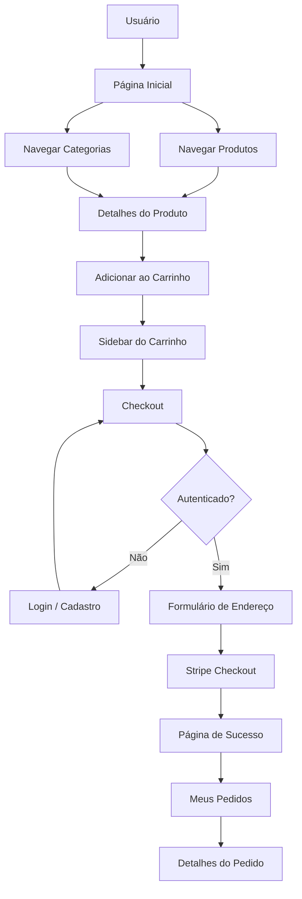
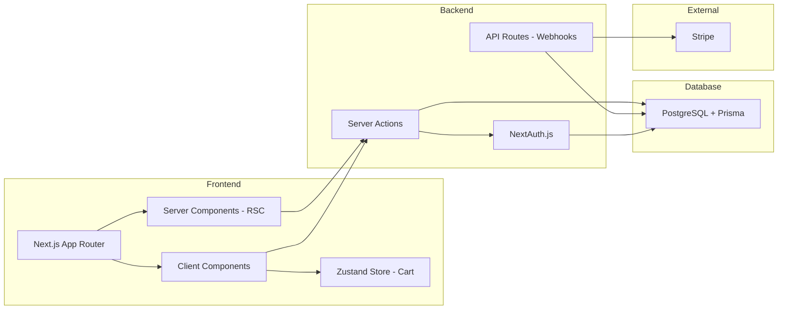

# Plano de Desenvolvimento — Red Crimson Marketplace

## Visão Geral

**Red Crimson Marketplace** — Marketplace especializado em produtos exclusivamente vermelhos. Estética gótico-sophisticated com temática vampírica.

E-commerce focado em vitrine (storefront) com UI/UX de alta performance, autenticação, carrinho de compras, checkout com Stripe e dashboard do usuário.

**Stack:** Next.js 16 (App Router) | TypeScript | Tailwind CSS v4 + shadcn/ui | PostgreSQL + Prisma | Zustand | NextAuth.js | Stripe

---

## Identidade Visual — Red Crimson Marketplace

> Design system completo em [`plans/design-system.md`](plans/design-system.md)

| Propriedade | Valor |
|-------------|-------|
| **Nome** | Red Crimson Marketplace |
| **Logotipo** | Taça de vinho (SVG inline) |
| **Elemento gráfico** | Lineart de presas de vampiro em backgrounds |
| **Paleta** | Vermelhos profundos, roxos, rosas, gold (toque de luxo) |
| **Tom** | Formal, ocasionalmente sofisticado |
| **Estilo** | Gótico-sophisticated, dark mode como padrão |

### Cores Principais

- `--red-crimson`: `#B22222` (primary)
- `--red-deep`: `#6B0000` (backgrounds escuros)
- `--purple-dark`: `#1A0A1E` (cards/superfícies)
- `--gold`: `#C9A84C` (accent de luxo)
- `--ivory`: `#F5E6D3` (texto claro)

### Fontes

- **Headings:** Playfair Display (sofisticação)
- **Body:** Inter (legibilidade)
- **Mono:** JetBrains Mono (preços/dados)

---

## Escopo Simplificado (Portfólio)

| Aspecto | Status |
|---------|--------|
| **Produtos** | Artificiais (seed data no banco) |
| **Carrinho** | Salvo localmente (localStorage via Zustand persist) |
| **Stripe** | Modo de teste (sandbox) |
| **Autenticação** | ❌ **Removida** — fluxo livre sem login |
| **Checkout** | Formulário de endereço + Stripe, sem necessidade de conta |
| **Pedidos** | Salvos no banco com nome/email do cliente |

---

## FASE 0 — Design System e Assets de Marca

> Design system completo em [`plans/design-system.md`](plans/design-system.md)

### 0.1 Configurar Tema Tailwind com Paleta Red Crimson

**Arquivo:** `src/app/globals.css`

- Substituir variáveis CSS `:root` e `.dark` com a paleta Red Crimson
- Adicionar cores: `--red-crimson`, `--red-deep`, `--red-bright`, `--red-rose`, `--purple-dark`, `--purple-mid`, `--purple-soft`, `--pink-soft`, `--gold`, `--ivory`, `--dark-base`, `--light-base`
- Configurar `@theme inline` com as novas cores
- Adicionar gradiente radial de fundo (efeito vinil/veludo)

### 0.2 Configurar Fontes no Layout

**Arquivo:** `src/app/layout.tsx`

- Adicionar `Playfair Display` (Google Fonts) para headings
- Manter `Inter` para body text (já configurado via Geist)
- Atualizar variáveis CSS: `--font-heading` e `--font-sans`

### 0.3 Criar Assets SVG

**Arquivos:**
- `src/components/ui/logo.tsx` — Componente SVG da taça de vinho (logotipo oficial)
- `src/components/ui/vampire-fangs.tsx` — Componente SVG das presas de vampiro (lineart decorativa)
- `src/components/ui/logo-icon.tsx` — Versão simplificada para favicon

### 0.4 Criar Componentes Decorativos

**Arquivo:** `src/components/ui/background-fangs.tsx`

- Componente de background com lineart de presas posicionado em cantos estratégicos
- Opacidade ajustável (5-10% para sutileza)
- Usado em Hero, páginas de login, checkout

---

## FASE 1 — Fundação e Infraestrutura

### 1.1 Instalar Dependências Ausentes

```bash
npm install zod react-hook-form @hookform/resolvers stripe @stripe/stripe-js @prisma/client sonner next-themes
```

| Pacote | Versão | Finalidade |
|--------|--------|------------|
| `zod` | latest | Validação de schemas (front + back) |
| `react-hook-form` | latest | Formulários performáticos |
| `@hookform/resolvers` | latest | Bridge zod + react-hook-form |
| `@prisma/client` | latest | ORM runtime |
| `stripe` | latest | SDK server-side Stripe |
| `@stripe/stripe-js` | latest | SDK client-side Stripe |
| `sonner` | latest | Toast notifications |
| `next-themes` | latest | Dark/light mode |

### 1.2 Prisma Client Singleton

**Arquivo:** `src/lib/prisma.ts`

Singleton do Prisma Client para evitar múltiplas conexões em hot-reload (desenvolvimento).

```typescript
import { PrismaClient } from "@prisma/client";

const globalForPrisma = globalThis as unknown as { prisma: PrismaClient };

export const prisma = globalForPrisma.prisma ?? new PrismaClient();

if (process.env.NODE_ENV !== "production") globalForPrisma.prisma = prisma;
```

### 1.3 Schema do Prisma

**Arquivo:** `prisma/schema.prisma`

Modelos principais:

- **Category** — id, name, slug, description, image, createdAt, updatedAt
- **Product** — id, name, slug, description, price (Decimal), comparePrice, images (String[]), categoryId, stock, isFeatured, isArchived, createdAt, updatedAt
- **Order** — id, customerName, customerEmail, customerPhone, items (OrderItem[]), status (PENDING/PAID/SHIPPED/DELIVERED/CANCELLED), total (Decimal), stripeSessionId, shippingAddress, createdAt, updatedAt
- **OrderItem** — id, orderId, productId, quantity, price (Decimal)

### 1.4 Migração Inicial

```bash
npx prisma migrate dev --name init
```

### 1.5 Providers da Aplicação

**Estrutura:** `src/components/providers/`

- `theme-provider.tsx` — ThemeProvider do next-themes (dark mode padrão)
- `toast-provider.tsx` — Toaster do sonner

### 1.6 Atualizar RootLayout

**Arquivo:** `src/app/layout.tsx`

Envolver com ThemeProvider + Toaster.

---

## FASE 2 — Vitrine (Storefront)

### 2.1 Store do Carrinho (Zustand)

**Arquivo:** `src/store/use-cart.ts`

- Estado: items[] (Product + quantity)
- Ações: addItem, removeItem, updateQuantity, clearCart
- Persist: localStorage via middleware persist
- Computed: totalItems, totalPrice

### 2.2 Header/Navbar

**Arquivo:** `src/components/layout/header.tsx`

- Logo + link para home
- Links de navegação (Produtos, Categorias)
- Campo de busca (opcional)
- Ícone do carrinho com badge (totalItems do Zustand) → abre CartSheet
- Avatar/Login (se autenticado, mostra nome; se não, link para /login)

### 2.3 Footer

**Arquivo:** `src/components/layout/footer.tsx`

- Informações da loja
- Links úteis
- Redes sociais
- Copyright

### 2.4 Hero/Banner

**Arquivo:** `src/components/home/hero-section.tsx`

- Banner principal da landing page
- CTA para ver produtos

### 2.5 ProductCard + ProductGrid

**Arquivos:**
- `src/components/product/product-card.tsx`
- `src/components/product/product-grid.tsx`

- ProductCard: imagem, nome, preço, botão "Adicionar ao carrinho"
- ProductGrid: grid responsivo de ProductCards

### 2.6 Página de Detalhes do Produto

**Rota:** `src/app/produto/[slug]/page.tsx`

- Server Component para fetch do produto
- Galeria de imagens
- Nome, descrição, preço
- Seletor de quantidade + "Adicionar ao carrinho" (Client Component)
- Produtos relacionados

### 2.7 Página de Listagem por Categoria

**Rota:** `src/app/categoria/[slug]/page.tsx`

- Server Component
- Filtro por categoria
- Grid de produtos

### 2.8 CartSheet (Sidebar do Carrinho)

**Arquivo:** `src/components/cart/cart-sheet.tsx`

- Sheet do shadcn/ui (já instalado)
- Lista de itens com quantidade e preço
- Subtotal
- Botão "Ir para o checkout"
- Botão "Limpar carrinho"

### 2.9 Página Inicial Completa

**Arquivo:** `src/app/page.tsx`

- Hero Section
- Produtos em destaque (featured)
- Categorias
- Newsletter (opcional)

---

## FASE 3 — Autenticação

### 3.1 Página de Login

**Rota:** `src/app/login/page.tsx`

- Formulário com email + senha
- Validação com zod + react-hook-form
- Server Action de autenticação
- Link para cadastro
- Botão "Entrar com Google" (opcional)

### 3.2 Página de Cadastro

**Rota:** `src/app/cadastro/page.tsx`

- Formulário: nome, email, senha, confirmar senha
- Validação com zod
- Server Action para criar usuário (hash senha com bcrypt)
- Redirecionar para login após cadastro

### 3.3 Schemas Zod

**Arquivo:** `src/lib/schemas/auth.ts`

- `loginSchema`: email (email), password (min 6)
- `registerSchema`: name (min 2), email (email), password (min 6), confirmPassword (must match)

### 3.4 Server Actions de Autenticação

**Arquivo:** `src/lib/actions/auth.ts`

- `loginAction`: valida zod → signIn("credentials")
- `registerAction`: valida zod → verifica email único → hash password → create user → redirect login

---

## FASE 4 — Checkout

### 4.1 Página de Checkout

**Rota:** `src/app/checkout/page.tsx`

- Rota protegida (requer autenticação)
- Divide em duas colunas: formulário + resumo do pedido

### 4.2 Formulário de Endereço

**Arquivo:** `src/components/checkout/address-form.tsx`

- Campos: nome completo, endereço, cidade, estado, CEP, telefone
- Schema zod de endereço
- react-hook-form com shadcn Form components

### 4.3 Resumo do Pedido

**Arquivo:** `src/components/checkout/order-summary.tsx`

- Lista de itens do carrinho
- Subtotal, frete (simulado), total
- Botão "Finalizar compra" → cria Stripe Checkout Session

### 4.4 Stripe Checkout Session (Server Action)

**Arquivo:** `src/lib/actions/checkout.ts`

- Criar ou atualizar ordem no banco
- Criar Stripe Checkout Session com line_items
- Retornar URL de redirecionamento

### 4.5 Webhook do Stripe

**Rota:** `src/app/api/webhooks/stripe/route.ts`

- Receber evento `checkout.session.completed`
- Atualizar status do pedido para PAID
- Limpar carrinho (opcional)

### 4.6 Página de Sucesso

**Rota:** `src/app/pedido/sucesso/page.tsx`

- Mensagem de confirmação
- Número do pedido
- Link para "Meus Pedidos"

---

## FASE 5 — Dashboard do Usuário

### 5.1 Página de Perfil

**Rota:** `src/app/conta/page.tsx`

- Dados do usuário (nome, email)
- Opção de editar perfil (opcional)

### 5.2 Histórico de Pedidos

**Rota:** `src/app/conta/pedidos/page.tsx`

- Lista de pedidos do usuário
- Status, data, total
- Link para detalhes

### 5.3 Detalhes do Pedido

**Rota:** `src/app/conta/pedidos/[id]/page.tsx`

- Itens do pedido
- Endereço de entrega
- Status do pagamento
- Total

---

## FASE 6 — Middleware e Proteção de Rotas

### 6.1 Middleware

**Arquivo:** `src/middleware.ts`

```typescript
export { default } from "next-auth/middleware";
```

### 6.2 Matcher

Configurar para proteger:
- `/checkout`
- `/conta/:path*`

---

## FASE 7 — SEO, Performance e Polimento

### 7.1 Metadados

- `generateMetadata` em páginas de produto e categoria (dinâmico)
- `layout.tsx` com metadata padrão (nome da loja, descrição)

### 7.2 Loading States

- `loading.tsx` em cada rota de página
- Skeletons para ProductCard

### 7.3 Error & Not Found

- `error.tsx` global e por página
- `not-found.tsx` customizado

### 7.4 Responsividade

- Testar em mobile, tablet, desktop
- Ajustar grid e layouts

---

## Diagrama de Fluxo





---

## Estrutura de Diretórios Final

```
src/
├── app/
│   ├── api/
│   │   ├── auth/[...nextauth]/
│   │   │   └── route.ts
│   │   └── webhooks/stripe/
│   │       └── route.ts
│   ├── checkout/
│   │   └── page.tsx
│   ├── login/
│   │   └── page.tsx
│   ├── cadastro/
│   │   └── page.tsx
│   ├── conta/
│   │   ├── page.tsx
│   │   └── pedidos/
│   │       ├── page.tsx
│   │       └── [id]/
│   │           └── page.tsx
│   ├── produto/[slug]/
│   │   └── page.tsx
│   ├── categoria/[slug]/
│   │   └── page.tsx
│   ├── pedido/sucesso/
│   │   └── page.tsx
│   ├── globals.css
│   ├── layout.tsx
│   ├── page.tsx
│   ├── loading.tsx
│   ├── error.tsx
│   └── not-found.tsx
├── components/
│   ├── cart/
│   │   └── cart-sheet.tsx
│   ├── checkout/
│   │   ├── address-form.tsx
│   │   └── order-summary.tsx
│   ├── home/
│   │   └── hero-section.tsx
│   ├── layout/
│   │   ├── header.tsx
│   │   └── footer.tsx
│   ├── product/
│   │   ├── product-card.tsx
│   │   └── product-grid.tsx
│   ├── providers/
│   │   ├── auth-provider.tsx
│   │   ├── theme-provider.tsx
│   │   └── toast-provider.tsx
│   └── ui/ (shadcn components)
├── lib/
│   ├── actions/
│   │   ├── auth.ts
│   │   └── checkout.ts
│   ├── schemas/
│   │   └── auth.ts
│   ├── utils.ts
│   ├── prisma.ts
│   └── auth.ts
├── store/
│   └── use-cart.ts
└── middleware.ts
```
